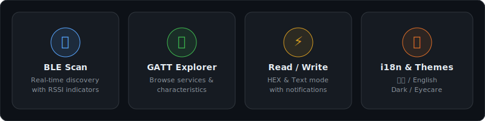
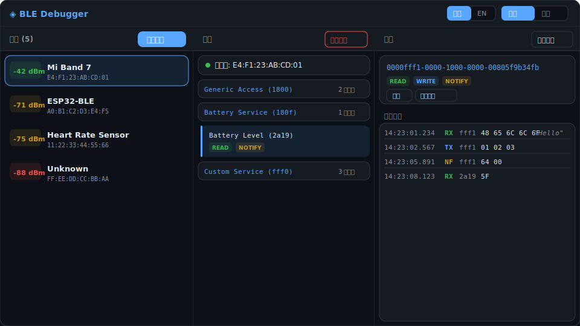
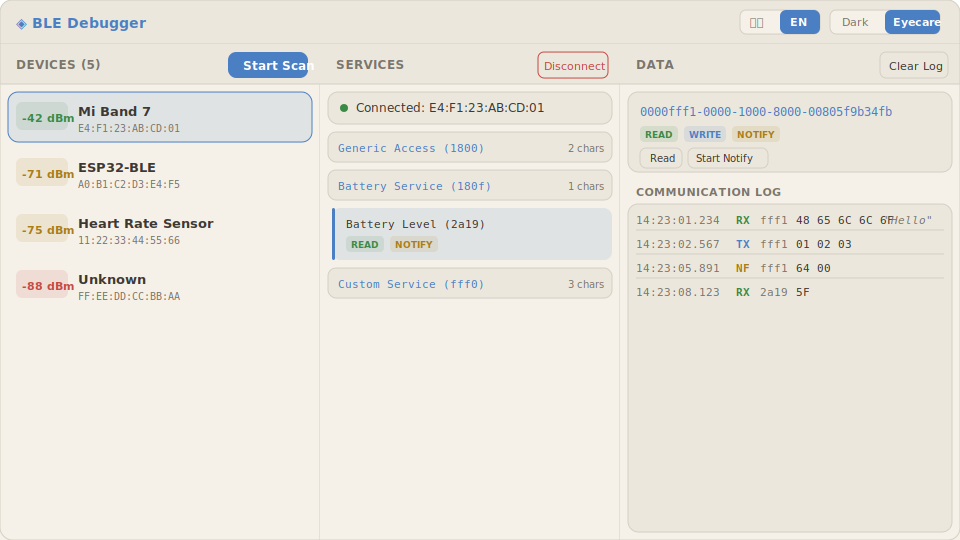

<div align="center">

# BLE Debugger

**Web-based Bluetooth Low Energy debugging tool**

一个基于浏览器的 BLE 调试工具，支持中英双语与深色/护眼双主题。

A browser-based BLE debugging tool with bilingual UI and dual themes.


</div>

---

## Features / 功能一览

<p align="center">
  
</p>

| Feature | Description |
|---------|-------------|
| **BLE Scan** | Real-time device discovery with RSSI signal strength indicators (color-coded) |
| **GATT Explorer** | Browse services, characteristics, and descriptors in a collapsible tree view |
| **Read / Write / Notify** | Read characteristic values, write in HEX or Text mode, subscribe to notifications |
| **Communication Log** | Timestamped log with direction tags (RX / TX / NOTIFY) and auto hex-to-text decode |
| **Bilingual UI** | Switch between 中文 and English with one click, preference saved locally |
| **Dual Themes** | Dark mode and Eyecare (warm beige) mode, preference saved locally |

---

## Preview / 界面预览

### Dark Theme / 深色主题

<p align="center">
  
</p>

### Eyecare Theme / 护眼主题

<p align="center">
  
</p>

---

## Quick Start / 快速开始

### 1. Install dependencies / 安装依赖

```bash
pip install -r requirements.txt
```

> Requires Python 3.10+ and a Bluetooth adapter on your system.

### 2. Run / 运行

```bash
python app.py
```

### 3. Open browser / 打开浏览器

Visit [http://localhost:5555](http://localhost:5555)

---

## Usage / 使用方法

```
1. Click "Start Scan" to discover nearby BLE devices
   点击「开始扫描」发现附近的 BLE 设备

2. Click a device to connect and browse its GATT services
   点击设备进行连接，浏览其 GATT 服务

3. Select a characteristic to read, write, or subscribe to notifications
   选择特征值进行读取、写入或订阅通知

4. All communication is logged in the right panel with timestamps
   所有通信记录会在右侧面板带时间戳地显示
```

---

## Tech Stack / 技术栈

| Layer | Technology |
|-------|-----------|
| Backend | [Flask](https://flask.palletsprojects.com/) + [Flask-SocketIO](https://flask-socketio.readthedocs.io/) |
| BLE | [Bleak](https://bleak.readthedocs.io/) (cross-platform BLE library) |
| Frontend | Vanilla HTML/CSS/JS + Socket.IO client |
| Real-time | WebSocket via Socket.IO |

---

## Project Structure / 项目结构

```
ble-debugger/
├── app.py              # Flask backend + BLE logic
├── requirements.txt    # Python dependencies
├── templates/
│   └── index.html      # Single-page frontend (i18n + themes built-in)
└── docs/
    ├── features.svg
    ├── preview-dark.svg
    └── preview-eyecare.svg
```

---

## Requirements / 系统要求

- Python 3.10+
- Bluetooth adapter (built-in or USB dongle)
- Linux: BlueZ 5.43+ (`sudo apt install bluez`)
- macOS: Built-in CoreBluetooth (no extra setup)
- Windows: Windows 10+

---

## License

MIT

