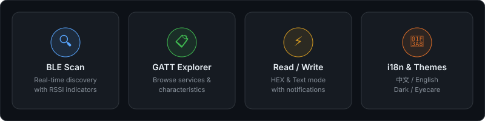
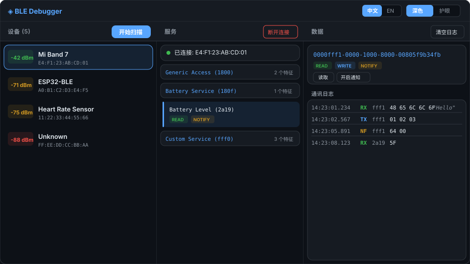
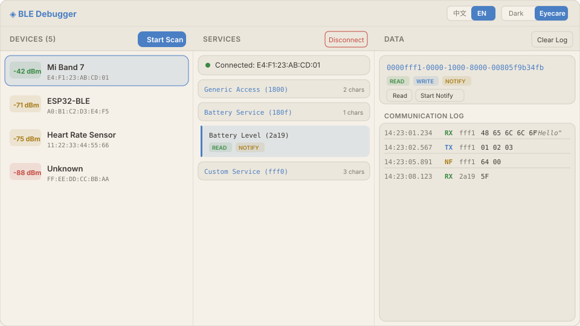

<div align="center">

# BLE Debugger

**Web-based Bluetooth Low Energy debugging tool**

一个基于浏览器的 BLE 调试工具，支持中英双语与深色/护眼双主题。

A browser-based BLE debugging tool with bilingual UI and dual themes.


</div>

---

## Features / 功能一览

<p align="center">
  
</p>

| Feature | Description |
|---------|-------------|
| **BLE Scan** | Real-time device discovery with RSSI signal strength indicators (color-coded) |
| **GATT Explorer** | Browse services, characteristics, and descriptors in a collapsible tree view |
| **Read / Write / Notify** | Read characteristic values, write in HEX or Text mode, subscribe to notifications |
| **Communication Log** | Timestamped log with direction tags (RX / TX / NOTIFY) and auto hex-to-text decode |
| **Automation API** | Local HTTP endpoints for scan, connect, services, read, write, notify, and AT command automation |
| **Bilingual UI** | Switch between 中文 and English with one click, preference saved locally |
| **Dual Themes** | Dark mode and Eyecare (warm beige) mode, preference saved locally |

---

## Preview / 界面预览

### Dark Theme / 深色主题

<p align="center">
  
</p>

### Eyecare Theme / 护眼主题

<p align="center">
  
</p>

---

## Quick Start / 快速开始

### 1. Install dependencies / 安装依赖

```bash
pip install -r requirements.txt
```

> Requires Python 3.10+ and a Bluetooth adapter on your system.

### 2. Run / 运行

```bash
python app.py
```

### 3. Open browser / 打开浏览器

Visit [http://localhost:5555](http://localhost:5555)

---

## Usage / 使用方法

```
1. Click "Start Scan" to discover nearby BLE devices
   点击「开始扫描」发现附近的 BLE 设备

2. Click a device to connect and browse its GATT services
   点击设备进行连接，浏览其 GATT 服务

3. Select a characteristic to read, write, or subscribe to notifications
   选择特征值进行读取、写入或订阅通知

4. All communication is logged in the right panel with timestamps
   所有通信记录会在右侧面板带时间戳地显示
```

---

## Automation API / 自动化接口

The same backend BLE operations used by the Web UI are also available through local HTTP endpoints.

Web UI 使用的同一套 BLE 后端能力，现在也可以通过本地 HTTP 接口调用。

### Available endpoints / 可用接口

| Method | Path | Purpose |
|--------|------|---------|
| `GET` | `/api/health` | Basic health check and runtime state |
| `GET` | `/api/state` | Current scan / connection / notify state |
| `POST` | `/api/scan/start` | Start background BLE scan |
| `GET` | `/api/scan/results` | Fetch current scan results |
| `POST` | `/api/scan/stop` | Stop BLE scan |
| `POST` | `/api/connect` | Connect by BLE address |
| `POST` | `/api/disconnect` | Disconnect current device |
| `GET` | `/api/services` | List connected GATT services |
| `POST` | `/api/read` | Read characteristic value |
| `POST` | `/api/write` | Write characteristic in HEX or Text |
| `POST` | `/api/notify` | Enable / disable notify |
| `POST` | `/api/read_descriptor` | Read descriptor by handle |
| `GET` | `/api/events` | Poll notification or reassembled frame history |
| `DELETE` | `/api/events` | Clear stored notification or frame history |
| `POST` | `/api/exchange` | Write once and wait for a notification/frame |
| `POST` | `/api/at/command` | Send AT text command and wait for a reassembled frame |

### Recommended flow for section-2 BLE testing / 第二部分蓝牙自测推荐流程

1. Start scan

```bash
curl -X POST http://127.0.0.1:5555/api/scan/start
```

2. Poll discovered devices

```bash
curl http://127.0.0.1:5555/api/scan/results
```

3. Connect to the target device

```bash
curl -X POST http://127.0.0.1:5555/api/connect \
  -H 'Content-Type: application/json' \
  -d '{"address":"AA:BB:CC:DD:EE:FF"}'
```

4. Inspect services and find your write / notify characteristic UUIDs

```bash
curl http://127.0.0.1:5555/api/services
```

5. Send an AT command and wait for a complete response frame

```bash
curl -X POST http://127.0.0.1:5555/api/at/command \
  -H 'Content-Type: application/json' \
  -d '{
    "write_uuid": "YOUR_WRITE_UUID",
    "notify_uuid": "YOUR_NOTIFY_UUID",
    "command": "AT+deviceinfo?",
    "with_response": true,
    "timeout_ms": 5000
  }'
```

The response includes the outgoing write and the first reassembled notification frame captured after that write.

返回结果会同时包含本次写入数据，以及写入之后捕获到的第一条重组后的通知帧。

### Example: generic write-and-wait / 通用写入并等待

```bash
curl -X POST http://127.0.0.1:5555/api/exchange \
  -H 'Content-Type: application/json' \
  -d '{
    "write_uuid": "YOUR_WRITE_UUID",
    "notify_uuid": "YOUR_NOTIFY_UUID",
    "value": "AT+wifitable?",
    "encoding": "text",
    "wait_kind": "frame",
    "with_response": true,
    "timeout_ms": 5000
  }'
```

### Poll captured notifications / 轮询通知结果

```bash
curl 'http://127.0.0.1:5555/api/events?kind=frame&since_id=0&limit=20'
```

### Notes / 说明

- For Linux + BlueZ, it is safer to connect after the device has been discovered by the built-in scanner.
- The API is intended for local lab automation. By default the app still listens on port `5555`.
- The AT command endpoint assumes your device responses can be reassembled by the built-in frame parser (`+READY:`, `ok\r\n`, `\r\nok\r\n`).

---

## Tech Stack / 技术栈

| Layer | Technology |
|-------|-----------|
| Backend | [Flask](https://flask.palletsprojects.com/) + [Flask-SocketIO](https://flask-socketio.readthedocs.io/) |
| BLE | [Bleak](https://bleak.readthedocs.io/) (cross-platform BLE library) |
| Frontend | Vanilla HTML/CSS/JS + Socket.IO client |
| Real-time | WebSocket via Socket.IO |

---

## Project Structure / 项目结构

```
ble-debugger/
├── app.py              # Flask backend + BLE logic
├── requirements.txt    # Python dependencies
├── templates/
│   └── index.html      # Single-page frontend (i18n + themes built-in)
└── docs/
    ├── features.svg
    ├── preview-dark.svg
    └── preview-eyecare.svg
```

---

## Requirements / 系统要求

- Python 3.10+
- Bluetooth adapter (built-in or USB dongle)
- Linux: BlueZ 5.43+ (`sudo apt install bluez`)
- macOS: Built-in CoreBluetooth (no extra setup)
- Windows: Windows 10+

---

## License

MIT
